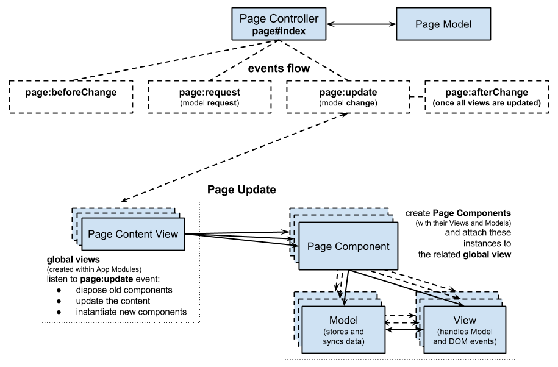

Client Side Architecture
========================

 * [Chaplin](#chaplin)
 * [Application](#application)
 * [App Modules](#app-modules)
 * [Page Controller](#page-controller)
 * [Page Component](#page-component)

## Chaplin

Client Side Architecture of Oro Platform is built over [Chaplin](http://chaplinjs.org/) (an architecture for JavaScript web applications based on the [Backbone.js](http://backbonejs.org/) library).

Backbone provides little structure above simple routing, individual models, views and their binding. Chaplin addresses these limitations by providing a light-weight but flexible structure which leverages well-proven design patterns and best practises.


See [Chaplin documentation](http://docs.chaplinjs.org/).

<a name="application"></a>
## Application
Application gets initialized requiring `oroui/js/app` module on a page (it's required from `OroUIBundle:Default:index.html.twig`):
```
    <script type="text/javascript">
        require(['oroui/js/app']);
    </script>
```
This module exports an instance of `Application` (extend of `Chaplin.Application`), depends on:
 1. `oroui/js/app/application`, Application class
 1. `oroui/js/app/routes`, collection of routers
 1. `oroui/js/app`'s configuration
 1. and some `app modules` (optional), see [App modules](#app-modules)

### Routes
Routes module (`oroui/js/app/routes`) it's an array with only one route, which matches any URL and refers to `index` method of `controllers/page-controller`:
```
    [
        ['*pathname', 'page#index']
    ]
```

### Application configuration
RequireJS [module configuration](http://requirejs.org/docs/api.html#config-moduleconfig) approach is utilized for passing options to application's constructor. Configuration is placed in `OroUIBundle::requirejs.config.js.twig` template and looks something like:
```
require({
    config: {
        'oroui/js/app': {
            baseUrl: {{ baseUrl|json_encode|raw }},
            headerId: {{ navigationHeader()|json_encode|raw }},
            userName: {{ userName|json_encode|raw }},
            root: {{ rootUrl|json_encode|raw }} + '\/',
            debug: Boolean({{ app.debug }}),
            skipRouting: '[data-nohash=true], .no-hash',
            controllerPath: 'controllers/',
            controllerSuffix: '-controller',
            trailing: null
        }
    }
});
```
It's placed in a twig-template in order to get access to backend variables in runtime. Which is impossible to do in `requirejs.yml` file.


##App Modules
App modules are atomic parts of general application, responsible for:

 * defining global view (which live beside active controller);
 * register handlers in `mediator` (see [Chaplin.mediator](http://docs.chaplinjs.org/chaplin.mediator.html));
 * and do all actions which precede creating an instance of application.

App modules are not actually modules, they export nothing. It's `requirejs()` just call, which is executed right before the application is started.

App modules are declared in `requirejs.yml` configuration file, in custom section `appmodules`:
```
config:
    appmodules:
        - oroui/js/app/modules/views-module
        - oroui/js/app/modules/messenger-module
```
This approach allows to define in each bundle code which should be executed on the application start.

##### Example 1
`oroui/js/app/modules/views-module` - declares global views which will be instantiated right before an action point of controller gains control
```javascript
require([
    'oroui/js/app/controllers/base/controller'
], function (BaseController) {
    'use strict';
    /* ... */

    /**
     * Init PageContentView
     */
    BaseController.loadBeforeAction([
        'oroui/js/app/views/page/content-view'
    ], function (PageContentView) {
        BaseController.addToReuse('content', PageContentView, {
            el: 'mainContainer'
        });
    });
    /* ... */
});
```
##### Example 2
`oroui/js/app/modules/messenger-module` - registers messenger's public methods as handlers in `mediator`
```javascript
require([
    'oroui/js/mediator',
    'oroui/js/messenger'
], function (mediator, messenger) {
    'use strict';

    /**
     * Init messenger's handlers
     */
    mediator.setHandler('showMessage',
        messenger.notificationMessage, messenger);
    mediator.setHandler('showFlashMessage',
        messenger.notificationFlashMessage, messenger);
    /* ... */
});
```

##Page Controller
Page Controller is a central part of platform's architecture. After [Chaplin.Dispatcher](http://docs.chaplinjs.org/chaplin.dispatcher.html) call the target method (which is `page#index`), Page Controller executes whole stack of page loading and triggers proper events on each stage. Page Model (`oroui/js/app/models/page-model`) is used as container for page's data and performs interactions with server (loads data on navigation, posts data on form submit). Page Controller also works with pages cache component and declares some [navigation handlers](./mediator-handlers.md#page-controller).



###Events

####Page loading stages

Event Name | Arguments
---------- | ---------
`'page:beforeChange'` | `oldRoute`, `newRoute`, `options` (can be triggered with no arguments)
`'page:request'` | `actionArgs`
`'page:update'` | `pageData`, `actionArgs`, `xhr`
`'page:afterChange'` | no arguments
`'page:redirect'` | no arguments

####Page error handling

Event Name | Arguments
---------- | ---------
`'page:beforeError'` | `xhr`, `payload`
`'page:error'` | `pageData`, `actionArgs`, `xhr`

## Page Component
Because our appproach is a "Blocks-Driven" application (meaning that one controller for all routes and loaded page-content consists of self-sufficient blocks), we introduce the new kind of entity that takes responsibility for initializing views, binding them with app's environment and disposing them at the appropriate time. Basically it performs the job of the controller and any page may contain mulitple components like this.

For additional details please read [Page Component](./page-component.md).
